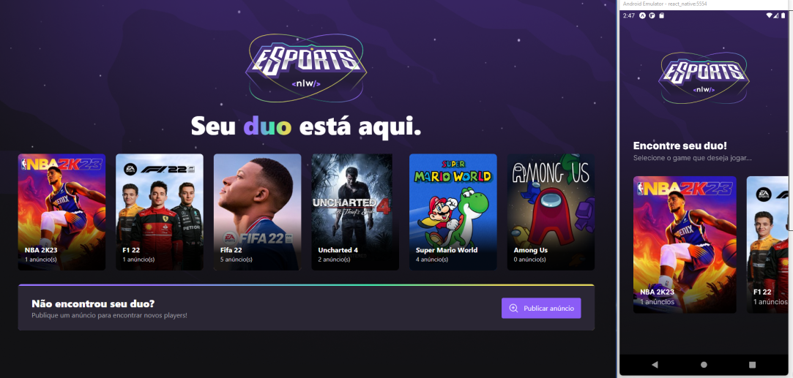

<p align="center">
</p>

<br>

Version of the **eSports** project on the [Next Level Week](https://lp.rocketseat.com.br/nlw) by Rocketseat.

<hr>
<br>

  - [Description](#description)
  - [Stack and tools](#stack-and-tools)
  - [Quickstart](#quickstart)

<br>

## Description

The project is called *Find your Duo*.
It is a platform to find the perfect partner to play your favorite game together, by connecting your Twitch.tv account.

<p align="center">
</p>

## Stack and tools
* [Node.js](https://nodejs.org/en/)
* [Prisma](https://www.prisma.io/)
* [React](https://reactjs.org/)
* [React Native](https://reactnative.dev/)
* [Expo](https://expo.dev/)
* [Figma](https://www.figma.com/)
* [Radix UI](https://www.radix-ui.com/)


## Quickstart

### Server

First, create a new ``.env`` file on the root directory, using the `.env.example` template as base.

Then, to create the local db run:
```sh
$ npm install
$ npm run db:migrate
```

After that, to start the server, run:
```sh
$ npm run dev
```

### Web

To run the local Vite web client:
```sh
$ npm install
$ npm run dev
```
